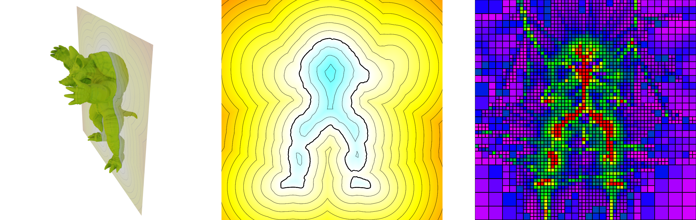
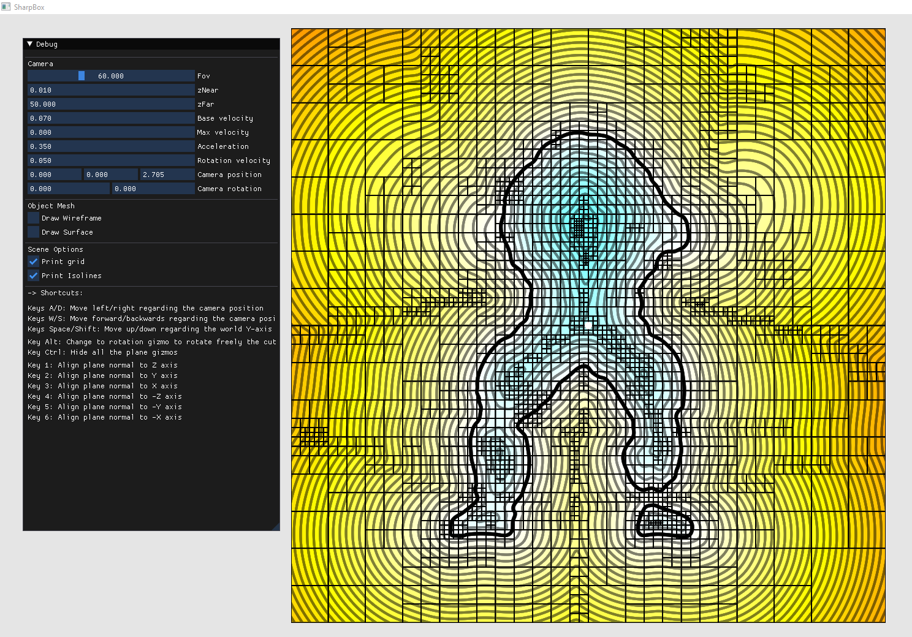

# SdfLib: Signed distance field from meshes



SdfLib is a library for accelerating the queries of signed distance fields from triangle meshes. The library has an exact method that always returns the distance to the nearest triangle and an approximated one that return distances with a configurable maximum error.

## Installing and Compiling

All the dependencies of the project are downloaded automatically during the cmake execution. The cmake execution can take some minutes to finish. In Windows, the project requires Visual Studio 2022.

### As a library

The project is managed with CMake. First, clone the repository in your libraries folder to add the library. Then, add the following lines in your CMakeList.txt:

```
add_subdirectory(SDFLIB_FOLDER_DIRECTORY)
target_link_libraries(YOUR_TARGET SdfLib)
```

### As an executable

Also, we offer some executables for testing and visualizing our structure. To compile the tools, first clone the repository. Open a console inside the project folder and execute the following commands:

#### In Windows
```
mkdir build
cd build
cmake ../ -G "Visual Studio 17 2022" -A x64 -DSDFLIB_BUILD_APPS=ON
```
Inside Visual Studio, open the project by searching for the ``SdfLib.sln`` file. Changing the building profile from Debug to Release is important because OpenMP is not supported correctly in Debug mode. Then, build the project solution.

Most of the tools are console applications. Therefore, open a command line and go to the ``Release`` folder inside the build folder to execute them.

#### In Linux
```
mkdir build
cd build
cmake ../ -DSDFLIB_BUILD_APPS=ON
make -j 4
```
## How to use

### As a library

The library offers two different algorithms:
- ``ExactOctreeSdf``: An algorithm for making fast and exact queries. The structure is an octree that stores the triangles influencing each leaf.
- ``OctreeSdf``: An algorithm for making approximated queries with a configurable expected error. The structure is an octree that stores the field's behavior as a polynomial at each leaf.

For more information about the structures, look at the Citations section.

The two algorithms are encapsulated in the class ``SdfFunction``, which encapsulates all the generic calls. Here we have an example:

```c++
#include <SdfLib/SdfFunction.h>

int main()
{
    // Load sdf already build from disk
    std::unique_ptr<SdfFunction> sdfFunc = SdfFunction::loadFromFile("PATH_TO_FOLDER/MY_SDF.bin");

    // Get field distance at the origin
    float d1 = sdfFunc->getDistance(glm::vec3(0.0f));

    // Get field distance and gradient at the origin
    glm::vec3 gradient;
    float d2 = sdfFunc->getDistance(glm::vec3(0.0f), gradient);

    // Store the structure to disk
    sdfFunc->saveToFile("PATH_TO_FOLDER/MY_SAVED_SDF.bin");
}
```
The two algorithms have their class with more structure-specific functions.

#### Building an exact signed distance field

```c++
#include <SdfLib/ExactOctreeSdf.h>

int main()
{
    // Load mesh
    Mesh mesh("PATH_TO_MESH/MY_MESH.ply");

    // Define the structure cover area as a bounding box
    BoundingBox box = mesh.getBoundingBox();
    const glm::vec3 modelBBsize = box.getSize();
    box.addMargin(0.2f * glm::max(glm::max(modelBBSize.x, modelBBSize.y), modelBBSize.z));

    // Build the structure
    ExactOctreeSdf exactSdf(mesh, box,
                            7, // Octree maximum depth
                            3, // Octree start depth
                            128, // The minimum number of triangles influencing a node.
                            8, // Number of threads
                        );

    
    // Store the structure to disk
    exactSdf.saveToFile("PATH_TO_FOLDER/MY_SAVED_SDF.bin");
}

```

#### Building an approximated signed distance field

```c++
#include <SdfLib/OctreeSdf.h>

int main()
{
    // Load mesh
    Mesh mesh("PATH_TO_MESH/MY_MESH.ply");

    // Define the structure cover area as a bounding box
    BoundingBox box = mesh.getBoundingBox();
    const glm::vec3 modelBBsize = box.getSize();
    box.addMargin(0.2f * glm::max(glm::max(modelBBSize.x, modelBBSize.y), modelBBSize.z));

    // Build the structure
    OctreeSdf octreeSdf(mesh, box,
                        7, // Octree maximum depth
                        3, // Octree start depth
                        1e-3, // The minimum error expected in a node.
                        OctreeSdf::InitAlgorithm::CONTINUITY, // The building algorithm
                        8, // Number of threads
                    );

    
    // Store the structure to disk
    octreeSdf.saveToFile("PATH_TO_FOLDER/MY_SAVED_SDF.bin");
}

```

### Using the tools

Next, we have some of the provided tools. We offer some executables to use the library without adding it to any project. In all the executables, you can use the argument ``-h`` to print the help message.

#### SdfExporter

SdfExporter is a console application that creates the desired structure from an input mesh and stores the resulting structure on disk.

Example using the exact structure:
```
./SdfExporter PATH_TO_FOLDER/MY_MESH.ply PATH_TO_FOLDER/MY_SAVED_SDF.bin -d 8 --start_depth 3 --sdf_format exact_octree --min_triangles_per_node 128 --num_threads 8
```

Example using the approximated structure:
```
./SdfExporter PATH_TO_FOLDER/MY_MESH.ply PATH_TO_FOLDER/MY_SAVED_SDF.bin -d 8 --start_depth 3 --sdf_format octree --termination_threshold 1e-3 --num_threads 8
```

#### SdfViewer

SdfViewer is an application to visualize the approximated signed distance field with plane cuts.

Important: Currently, this application only supports the approximated method, not the exact one.

Example:
```
./SdfExporter PATH_TO_MODELS_FOLDER/Armadillo.ply PATH_TO_FOLDER/MY_SAVED_SDF.bin -d 8 --start_depth 3 --sdf_format octree --termination_threshold 1e-3 --num_threads 8 -n

./SdfViewer PATH_TO_MODELS_FOLDER/Armadillo.ply --in PATH_TO_FOLDER/MY_SAVED_SDF.bin -n
```

Notice that in both calls, we use the argument ``-n``. This option normalizes the model coordinates between -1 to 1 to avoid problems in the visualization.



#### SdfError

SdfError is a console application that computes the error of the approximated method regarding the exact one.

## License

SdfLib is licensed under MIT License. Please, see the [license](https://github.com/UPC-ViRVIG/SdfLib/LICENSE) for further details.

## Citations

If you are using the exact method algorithm for a publication, please cite the paper:

```
@article{triangleInfluence,
  title={Triangle influence supersets for fast distance computation},
  author={Eduard Pujol and Antonio Chica},
  booktitle={},
  doi = {},
  journal = {Computer Graphics Forum},
  year = {2023}
}
```

If you are using the approximated method algorithm for a publication, please cite the paper:

```
@inproceedings{appoxSDF,
  title={Adaptive approximation of signed distance fields through piecewise continuous interpolation},
  author={Eduard Pujol and Antonio Chica},
  booktitle={},
  doi = {},
  publisher = {},
  year = {}
}
```